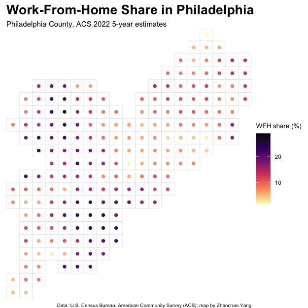

# Day 16 of 30 Day Map Challenge - Cell

**Day 16 (Cell)**: I created a cellular grid-based visualization of work-from-home patterns across Philadelphia, showcasing the spatial distribution of remote work adoption at the neighborhood level. This map employs a 1.5 km square grid system to aggregate census tract data into discrete cells, with colored points at each cell's centroid representing the average work-from-home share. The magma color scheme effectively highlights areas with higher remote work percentages (lighter colors) versus traditional commuting patterns (darker colors), revealing interesting spatial variations across the city's neighborhoods.

The work-from-home data comes from the U.S. Census Bureau's American Community Survey (ACS) 2022 5-year estimates, specifically tracking workers who primarily work from home (variable B08301_021) as a percentage of total workers (B08301_001). This cellular approach to mapping demonstrates how discrete geographic units can reveal patterns in human behavior and socioeconomic phenomena, making it particularly relevant for the "Cell" theme which focuses on mapping through small, discrete units or networks.

**Technical Implementation:**
- **tidycensus** - R package for accessing US Census Bureau data including the American Community Survey
- **sf** - R package for handling spatial vector data and geometric operations
- **dplyr** - R package for data manipulation and transformation (via tidyverse)
- **ggplot2** - R's powerful data visualization package
- **stringr** - R package for string manipulation (via tidyverse)

**Data Sources:**
- **Work-From-Home Data**: [U.S. Census Bureau American Community Survey (ACS)](https://www.census.gov/programs-surveys/acs) - 2022 5-year estimates at census tract level for Philadelphia County
- **Geographic Boundaries**: Census tract geometries from the tidycensus package (derived from TIGER/Line shapefiles)
