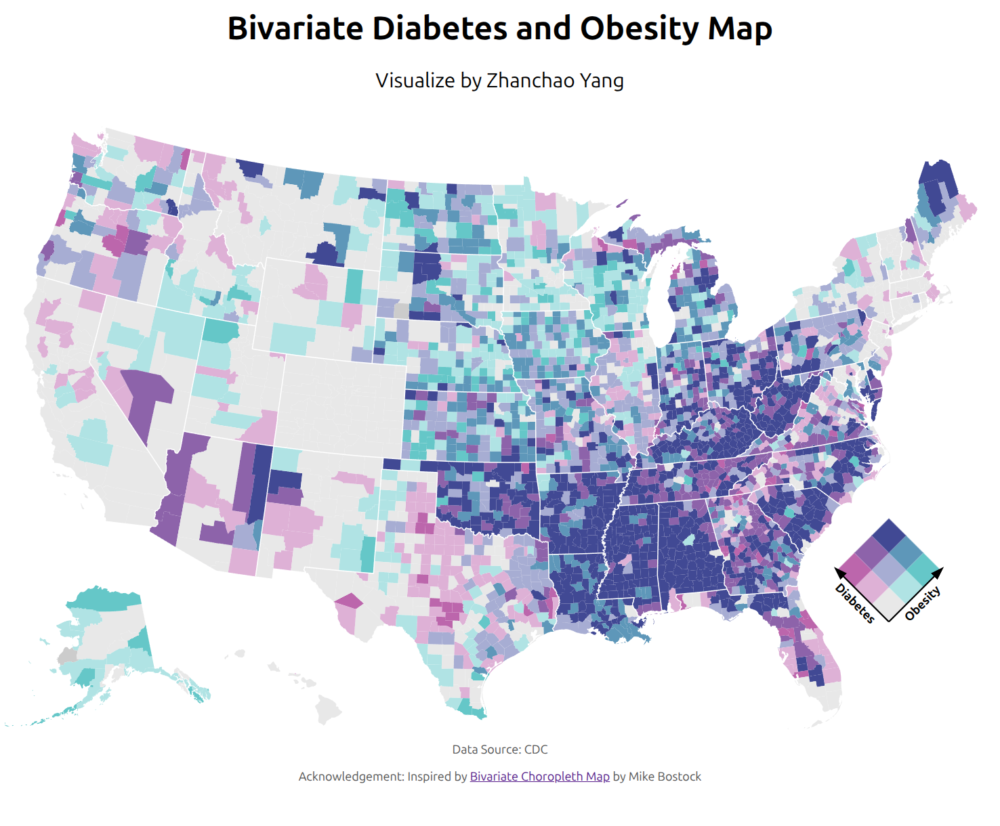

# Day 17 of 30 Day Map Challenge - A New Tool

**Day 17 (A New Tool)**: I explored D3.js for the first time to create an interactive bivariate choropleth map visualizing the relationship between diabetes and obesity rates across U.S. counties. This map employs a 3×3 color grid to simultaneously represent two variables, where each county is colored based on its quantile position for both diabetes prevalence and obesity rates. The bivariate approach reveals spatial patterns in the co-occurrence of these health conditions, highlighting regions where both rates are elevated (darker purple tones) versus areas with lower prevalence (lighter tones).

The visualization uses a bivariate color scheme from Joshua Stevens' palette collection, where one axis represents diabetes rates and the other represents obesity rates. This technique allows viewers to understand not just the individual prevalence of each condition, but also their spatial correlation across the United States. The map is built entirely with D3.js, demonstrating the library's powerful capabilities for creating sophisticated web-based cartographic visualizations.

**Technical Implementation:**
- **D3.js** - JavaScript library for creating dynamic, interactive data visualizations in web browsers using SVG, Canvas and HTML
- **TopoJSON** - Extension of GeoJSON that encodes topology for more efficient geographic data representation
- **HTML/CSS/JavaScript** - Standard web technologies for structure, styling, and interactivity
- **Observable** - Inspiration drawn from Mike Bostock's bivariate choropleth example

**Data Sources:**
- **Health Data**: [CDC Diabetes and Obesity Data](https://gist.githubusercontent.com/mbostock/74a5eafd839597f6c66a1c1dcb6f499f/raw/1742edce177a3b6d059715d2e04fa1315f23c600/cdc-diabetes-obesity.csv) - County-level diabetes and obesity prevalence rates
- **Geographic Boundaries**: [US Atlas TopoJSON](https://cdn.jsdelivr.net/npm/us-atlas@3/counties-albers-10m.json) - U.S. counties and states in Albers projection (975×610 viewBox)
