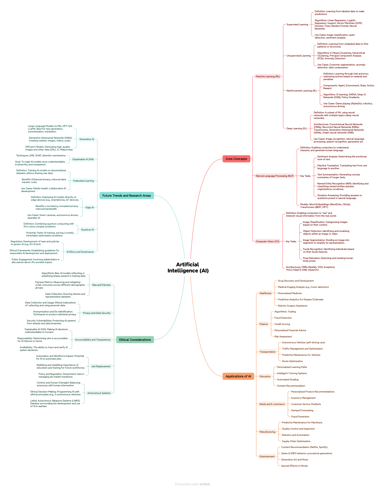

# Day 18 of 30 Day Map Challenge - Out of this world

**Day 18 (Out of this world)**: I created an interactive mental map visualizing the conceptual landscape of my research interests and academic journey in urban planning and spatial analytics. This map moves beyond physical geography to chart the intellectual terrain of ideas, methodologies, and connections that shape my work. The visualization employs a mind-mapping approach to represent the interconnected nature of various urban planning concepts, analytical techniques, and research domains, creating a cartography of thought rather than place.

Explore the interactive mental map: https://app.xmind.com/share/DnP1dXlU?xid=sFLJOd0S

**Technical Implementation:**
- **Xmind** - Mind mapping and brainstorming software for creating hierarchical visualizations of ideas and concepts
- **Mental Mapping** - Conceptual cartography technique for visualizing non-physical spaces, relationships, and knowledge structures

**Data Sources:**
- **Personal Knowledge**: Self-curated collection of research interests, academic concepts, and methodological approaches in urban planning and spatial analytics
