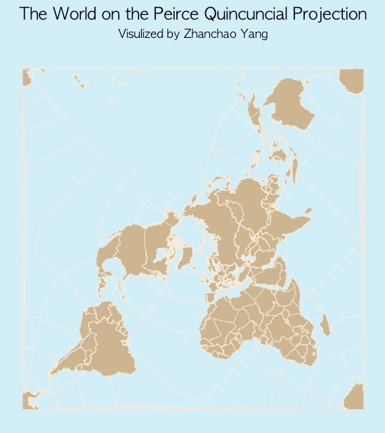

# Day 19 of 30 Day Map Challenge - Projections

**Day 19 (Projections)**: I created a world map using the Waterman Butterfly projection, a unique polyhedral map projection that aims to minimize distortion by representing the Earth's surface on an unfolded octahedron. The Waterman Butterfly projection, also known as the Peirce quincuncial projection in square form, was developed by Steve Waterman as an interrupted projection that resembles a butterfly shape when displayed. This projection is particularly notable for its aesthetic appeal and relatively low overall distortion, making it an interesting alternative to traditional rectangular world map projections while maintaining recognizable continental shapes.

**Technical Implementation:**
- **rnaturalearth** - R package for accessing Natural Earth vector map data at various scales
- **sf** - R package for handling spatial vector data and geometric operations
- **ggplot2** - R's powerful data visualization package for creating the map visualization
- **tidyverse** - Collection of R packages for data manipulation and visualization

**Data Sources:**
- **Geographic Boundaries**: [Natural Earth](https://www.naturalearthdata.com/) - Medium-scale country boundaries accessed via the rnaturalearth package
- **Projection**: Waterman Butterfly (Peirce quincuncial) projection with custom parameters (lon_0=25, shape=square)

**Reference Map**

