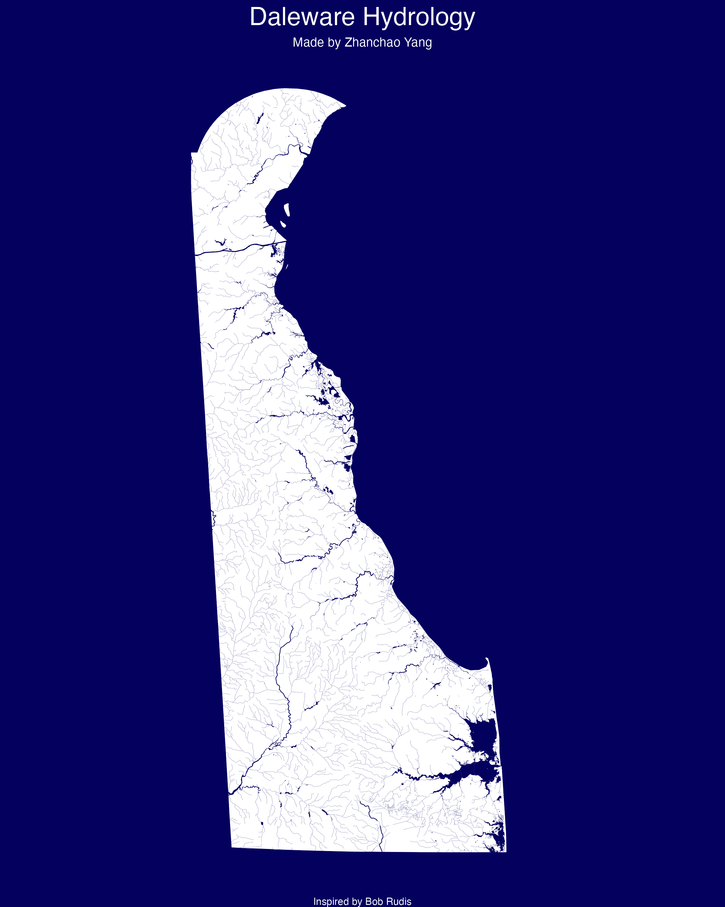

# Day 20 of 30 Day Map Challenge - Water

**Day 20 (Water)**: I created a visualization of Delaware's hydrology, showcasing the intricate network of water bodies and river systems throughout the state. This map uses data from the US Census Bureau's TIGER/Line shapefiles to visualize both area water features (lakes, ponds, reservoirs) and linear water features (rivers, streams, creeks) in Delaware. The visualization employs a dark navy blue color scheme (#04005e) against a white base, creating a striking contrast that emphasizes the water features across all three Delaware counties.

The map highlights major rivers by rendering them with thicker lines (0.25 size) compared to smaller streams and creeks (0.04 size), making it easy to identify primary waterways like the Delaware River and other major tributaries. The visualization combines both polygon water features (lakes and ponds) and linear features (rivers and streams) to provide a comprehensive view of Delaware's water infrastructure.

**Acknowledgement:**

This visualization was inspired by **Bob Rudis**' excellent work on hydrology mapping: [https://rud.is/books/30-day-map-challenge/hydrology-01.html](https://rud.is/books/30-day-map-challenge/hydrology-01.html).

**Technical Implementation:**
- **sf (Simple Features)** - R package for handling spatial vector data and geometric operations
- **tigris** - R package for downloading TIGER/Line shapefiles from the US Census Bureau, providing access to geographic boundaries and hydrographic features
- **tidyverse** - R's ecosystem of packages for data manipulation and visualization, including ggplot2 and purrr for functional programming
- **ggplot2** - R's powerful data visualization package (via tidyverse) for creating the map visualization

**Data Sources:**
- **County Boundaries**: US Census Bureau TIGER/Line Shapefiles via the tigris package - Delaware counties (New Castle, Kent, Sussex)
- **Area Water Features**: US Census Bureau TIGER/Line Area Hydrography Shapefiles - Lakes, ponds, and reservoirs in Delaware counties
- **Linear Water Features**: US Census Bureau TIGER/Line Linear Hydrography Shapefiles - Rivers, streams, and creeks in Delaware counties, with emphasis on features identified as "River" in their full name

**Color Palette:**
- Background/Water Color: #04005e (Deep Navy Blue)
- Base Fill: White
- Rivers are differentiated by size based on their classification in the FULLNAME attribute
