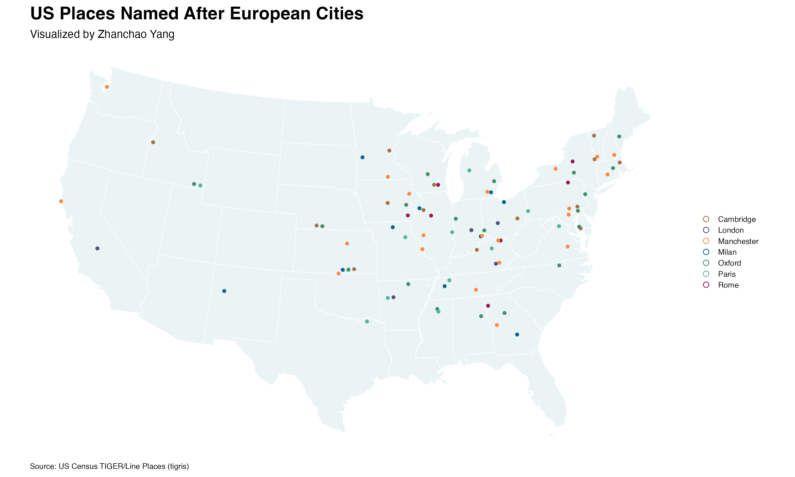

# Day 24 of 30 Day Map Challenge - Places and their names

**Day 24 (Places and their names)**: I created a map exploring the fascinating phenomenon of American toponymy by visualizing US places named after European cities. This map focuses on how European place names were transplanted to the United States, showcasing multiple instances of Paris, London, Rome, Oxford, Cambridge, Manchester, and Milan scattered across the continental United States. The visualization uses a clean, minimalist design with custom color coding for each city name, making it easy to see the geographic distribution of these European-inspired place names across different states. This project demonstrates how place names tell stories of cultural heritage, migration patterns, and the aspirations of early American settlers who named their communities after famous European cities.

**Technical Implementation:**
- **tigris** - R package for downloading TIGER/Line shapefiles from the US Census Bureau, providing access to state boundaries and incorporated place data
- **sf (Simple Features)** - R package for handling spatial vector data and geometric operations, including coordinate transformations
- **dplyr** - R package from the tidyverse for data manipulation and filtering
- **stringr** - R package for string manipulation, used for cleaning and matching place names
- **ggplot2** - R's powerful data visualization package for creating the map visualization
- **ggrepel** - R package for intelligent label placement (loaded for potential label support)
- **tibble** - R package for modern data frame operations
- **grid** - R package for low-level graphics operations
- **systemfonts** - R package for font management in R graphics

**Cartographic Approach:**
- **Projection**: EPSG:5070 (NAD83 / Conus Albers) - An equal-area projection appropriate for visualizing the continental United States
- **Geographic Scope**: Continental United States (excluding Alaska and Hawaii)
- **Data Processing**: Places were filtered to match seven European city names, then joined with their country of origin
- **Visualization Strategy**: Each European city name is assigned a distinct color, with point locations represented at place centroids for clearer visualization
- **Color Palette**: Custom colors for each city name:
  - Paris: Teal (#52b69a)
  - London: Purple (#5c4d7d)
  - Rome: Magenta (#a01a58)
  - Oxford: Forest Green (#40916c)
  - Cambridge: Brown (#a9714b)
  - Manchester: Orange (#ff8847)
  - Milan: Navy Blue (#05668d)

**Data Sources:**
- **Place Data**: [U.S. Census Bureau TIGER/Line Shapefiles 2024](https://www.census.gov/geographies/mapping-files/time-series/geo/tiger-line-file.html) - Cartographic boundary files for incorporated places and census-designated places (CDPs)
- **State Boundaries**: [U.S. Census Bureau TIGER/Line Shapefiles 2024](https://www.census.gov/geographies/mapping-files/time-series/geo/tiger-line-file.html) - Generalized state boundary files

**European Cities Featured:**
- **Paris** (France) - Multiple US places named after the capital of France
- **London** (United Kingdom) - US communities named after England's capital
- **Rome** (Italy) - American places inspired by the Eternal City
- **Oxford** (United Kingdom) - US places named after the famous university town
- **Cambridge** (United Kingdom) - American communities named after another renowned university city
- **Manchester** (United Kingdom) - US places named after the historic industrial city
- **Milan** (Italy) - American places named after Italy's fashion and design capital
