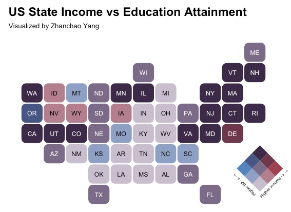

# Day 25 of 30 Day Map Challenge - Hexagons

**Day 25 (Hexagons)**: I created a bivariate choropleth map using hexagonal state bins to visualize the relationship between median household income and educational attainment (Bachelor's degree or higher) across the continental United States. This visualization combines the hexbin cartogram approach with bivariate color scaling, where the position on the 3x3 color grid indicates both income level and education percentage simultaneously. States in the purple spectrum represent areas with both high income and high education rates, while the color gradient transitions through different combinations of these two variables. The hexagonal format provides equal visual weight to each state, eliminating the geographic size bias that traditional choropleth maps often present.

**Technical Implementation:**
- **tidycensus** - R package for accessing US Census Bureau data, including the American Community Survey (ACS), enabling direct retrieval of socioeconomic indicators by geography
- **tidyverse** - Collection of R packages for data manipulation and visualization, providing the foundation for data wrangling operations
- **statebins** - R package for creating hexagonal and square state cartograms, representing each US state as equal-sized geometric shapes
- **biscale** - R package for creating bivariate color scales and maps, enabling the visualization of two variables simultaneously through a color matrix
- **cowplot** - R package for combining and arranging multiple ggplot2 visualizations, used for placing the legend overlay on the main map
- **ggplotify** - R package for converting various R graphics objects to ggplot2-compatible format, used for rotating the bivariate legend

**Data Sources:**
- **Median Household Income**: [U.S. Census Bureau American Community Survey (ACS) 2023 1-Year Estimates](https://www.census.gov/programs-surveys/acs) - Variable B19013_001 representing median household income by state
- **Educational Attainment**: [U.S. Census Bureau American Community Survey (ACS) 2023 1-Year Estimates](https://www.census.gov/programs-surveys/acs) - Variable S1501_C02_015E representing the percentage of population with Bachelor's degree or higher

**Visualization Details:**
- **Color Palette**: DkViolet bivariate palette with 3x3 dimensional classification
- **Geographic Scope**: Continental United States (48 states, excluding Alaska and Hawaii)
- **Classification Method**: Quantile-based classification for both variables
