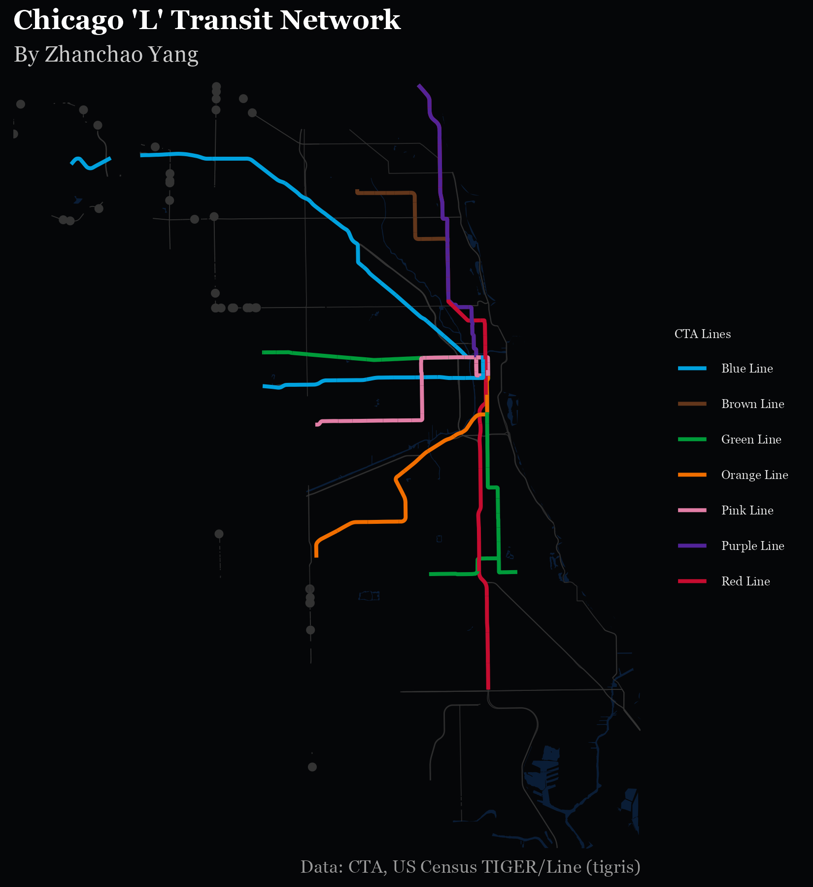

# Day 26 of 30 Day Map Challenge - Transport

**Day 26 (Transport)**: I created a stylized map of Chicago's iconic 'L' transit network, showcasing the city's comprehensive public rail system against a dark urban backdrop. This visualization highlights seven CTA (Chicago Transit Authority) rail lines—Red, Blue, Brown, Green, Orange, Purple, and Pink—each rendered in their official brand colors. The map layers transit routes over major highways (Interstates, US, and State routes) and water features, providing geographic context while emphasizing the transit network's extensive coverage throughout the city. The dark theme creates a striking visual effect that makes the colored transit lines pop, reminiscent of subway maps and urban transit diagrams.

**Technical Implementation:**
- **sf (Simple Features)** - R package for handling spatial vector data and geometric operations, including coordinate transformations and spatial intersections
- **tigris** - R package for downloading TIGER/Line shapefiles from the US Census Bureau, providing access to city boundaries, roads, and water features
- **tidyverse** - Collection of R packages for data manipulation and visualization, including ggplot2 for map creation and dplyr/stringr for data wrangling
- **ggplot2** - R's powerful data visualization package, used with `geom_sf()` for creating the layered map visualization with custom color scales

**Data Sources:**
- **CTA Rail Lines**: [Chicago Transit Authority Rail Lines Shapefile](https://data.cityofchicago.org/) - Official shapefile containing the geometry and attributes of Chicago's 'L' transit system rail lines
- **City Boundary**: [U.S. Census Bureau TIGER/Line Shapefiles 2023](https://www.census.gov/geographies/mapping-files/time-series/geo/tiger-line-file.html) - Chicago city boundary from Illinois places via tigris package
- **Roads**: [U.S. Census Bureau TIGER/Line Shapefiles](https://www.census.gov/geographies/mapping-files/time-series/geo/tiger-line-file.html) - Cook County road network filtered to major routes (Interstates, US Routes, State Routes)
- **Water Features**: [U.S. Census Bureau TIGER/Line Shapefiles](https://www.census.gov/geographies/mapping-files/time-series/geo/tiger-line-file.html) - Cook County area water features (lakes, rivers)

**CTA Rail Lines Featured:**
- **Red Line** - North-South spine connecting Howard to 95th/Dan Ryan
- **Blue Line** - O'Hare to Forest Park, serving the Loop
- **Brown Line** - Ravenswood service to the Loop
- **Green Line** - West-South service connecting Harlem to Ashland/63rd and Cottage Grove
- **Orange Line** - Midway Airport connection to the Loop
- **Purple Line** - Evanston service with express runs to the Loop
- **Pink Line** - Cermak service connecting the Loop to 54th/Cermak
