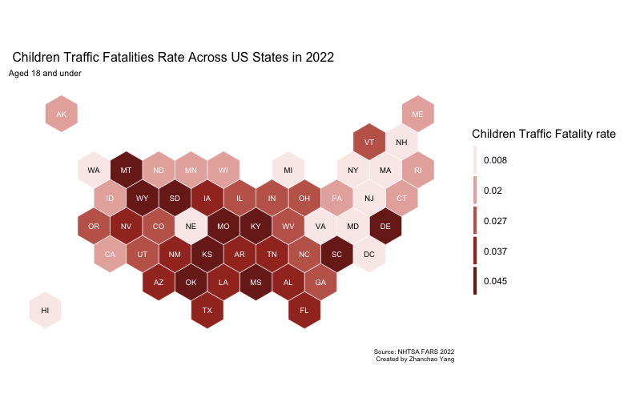
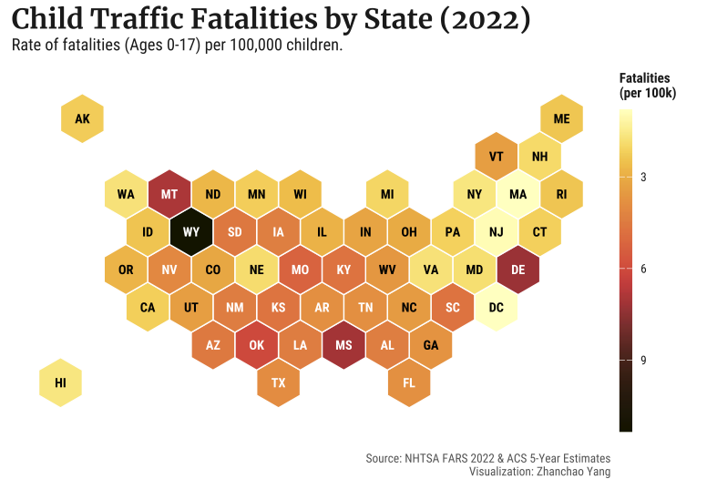

# Day 30 of 30 Day Map Challenge - Makeover

**Day 30 (Makeover)**: For the final day of the 30 Day Map Challenge 2025, I revisited and improved a map I co-created with Xian Lu Lee (MUSA'24) during the 2024 30DayMapChallenge. The original hexagon map visualized child traffic fatality rates at the state level across the United States, using data from the National Highway Traffic Safety Administration (NHTSA) and the Department of Transportation. This makeover focuses on enhancing the visual communication, statistical accuracy, and overall design quality of the visualization. This map improvement utilizes help from Gemini3 (LLM).

## Before & After
### Previous Version 
 

### Improved Version 
 

## Key Improvements

### 1. Unit Standardization (per 1,000 → per 100,000)
**Previous**: Fatality rate calculated as `count/estimate*1000`
```r
# Previous approach
state_fat <- state_fat %>%
  mutate(fatality_rate = count/estimate*1000)
```

**Improved**: Fatality rate calculated as `count/estimate*100000`
```r
# Improved approach
state_fat <- state_fat %>%
  mutate(fatality_rate = count/estimate*100000)
```

Using per 100,000 is the public health standard for mortality rates, making the values more intuitive and comparable to other health statistics.

### 2. Color Palette Enhancement
**Previous**: Custom flat reds palette with manual quantile breaks
```r
flatreds5 <- c('#f9ebea','#e6b0aa','#c2665b', '#a33428','#7b241c')
q5 <- function(variable) {as.factor(ntile(variable, 5))}
```

**Improved**: Perceptually uniform `scico` palette ("lajolla") with continuous gradient
```r
scale_fill_scico(
  palette = "lajolla", 
  direction = 1,
  name = "Fatalities\n(per 100k)",
  n.breaks = 5
)
```

The `scico` package provides perceptually uniform and scientifically accurate color palettes, colorblind-friendly, and print well in grayscale.

### 3. Classification Method (Quantiles → Continuous Scale)
**Previous**: Discrete quantile-based classification that groups states into five equal-count bins
**Improved**: Continuous color gradient that better represents the actual data distribution, allowing viewers to perceive subtle differences between states with similar rates

### 4. Typography and Readability
**Previous**: Default system fonts with basic styling
```r
plot.title = element_text(size=12),
plot.subtitle = element_text(size=8),
plot.caption = element_text(size = 6)
```

**Improved**: Custom Google Fonts with enhanced hierarchy
```r
font_add_google("Roboto Condensed", "roboto")
font_add_google("Merriweather", "serif_font")
showtext_auto()

# Applied in theme
plot.title = element_text(family = "serif_font", face = "bold", size = 18, hjust = 0),
plot.subtitle = element_text(size = 11, margin = margin(b = 15)),
plot.caption = element_text(size = 8, color = "#666666", hjust = 1, margin = margin(t = 20))
```

### 5. Dynamic Text Color for Accessibility
**Previous**: Static text color array based on position
```r
text_inv <- c('black', 'white','white','white','white')
scale_color_manual(values=text_inv)
```

**Improved**: Dynamic text color calculation based on background darkness
```r
threshold <- quantile(states_sf$fatality_rate, 0.6, na.rm=TRUE)
states_sf <- states_sf %>%
  mutate(text_color = ifelse(fatality_rate > threshold, "white", "black"))
scale_color_identity()
```

### 6. Theme Simplification
**Previous**: Verbose custom `mapTheme` with many explicit settings
**Improved**: Clean `theme_void()` base with targeted customizations, resulting in cleaner, more maintainable code

### 7. Project Structure and File Management
**Previous**: Used `rstudioapi::getActiveDocumentContext()$path` for relative paths
```r
current_path = rstudioapi::getActiveDocumentContext()$path
setwd(dirname(current_path))
```

**Improved**: Uses R Project-relative paths for reproducibility
```r
con <- dbConnect(duckdb::duckdb(), dbdir = "data/day30/raw_data.duckdb")
state_dets <- read.csv('data/day30/state-details.csv')
```

### 8. Legend Improvements
**Previous**: Discrete legend with quantile break labels
**Improved**: Continuous color bar with clear unit labeling ("Fatalities per 100k")

---

## Technical Implementation

- **duckdb** - High-performance analytical database for storing and querying NHTSA FARS data efficiently
- **tidyverse** - Collection of R packages for data manipulation and visualization, providing the foundation for data wrangling operations
- **ggplot2** - R's powerful data visualization package for creating layered graphics with hexagonal geometry
- **sf (Simple Features)** - R package for handling spatial vector data and geometric operations, including reading GeoPackage files and coordinate transformations
- **mapproj** - R package providing map projection capabilities
- **showtext** - R package enabling the use of custom Google Fonts in R graphics for improved typography
- **scico** - R package providing scientifically-derived color palettes that are perceptually uniform and colorblind-friendly
- **scales** - R package for formatting axis labels and legend values
- **tidycensus** - R package for accessing US Census Bureau data, used to retrieve under-18 population estimates from ACS 5-Year Estimates

## Data Sources

- **Traffic Fatalities**: [NHTSA Fatality Analysis Reporting System (FARS) 2022](https://www.nhtsa.gov/research-data/fatality-analysis-reporting-system-fars) - Individual-level crash data filtered for persons under 18 with fatal injuries (INJ_SEV=4)
- **Population Data**: [U.S. Census Bureau American Community Survey (ACS) 2022 5-Year Estimates](https://www.census.gov/programs-surveys/acs) - Variable B09001_001 representing population under 18 by state
- **Hexagonal Grid**: [US States Hexgrid GeoPackage](https://team.carto.com/u/andrew/tables/andrew.us_states_hexgrid/public/map) - Equal-area hexagonal representation of US states for cartogram visualization

## Acknowledgement

I am grateful to my friend and colleague, Xian Lu, for visualizing last year’s map using the data I cleaned. I also acknowledge the improvement suggestions from large language models such as Gemini and ChatGPT.

## Conclusion: Reflecting on 30 Days of Mapping

This 30 Day Map Challenge 2025 has been an incredible journey of exploration, learning, and creative expression through cartography. Over the past month, I've pushed the boundaries of my mapping skills, experimenting with new tools, techniques, and data sources.

**Highlights from this challenge:**
- Explored **diverse themes** from classical elements (Earth, Air, Fire, Water) to futuristic speculation (Map from 2125)
- Learned **new tools** including DeckGL for web-based 3D visualization and NASA's Black Marble data
- Created maps ranging from **minimal designs** to complex **bivariate choropleth visualizations**
- Worked with various data types: points, lines, polygons, rasters, and hexagonal tessellations
- Combined **creativity with technical rigor** throughout the process

This final makeover exercise demonstrates that cartography is an iterative process—maps can always be improved with fresh perspectives, better tools, and evolved design sensibilities. The improvements made today showcase how attention to detail in color theory, typography, and data presentation can transform a good map into a great one.

Thank you for following along with this challenge. Here's to many more maps in the future! 🗺️

*— Zhanchao Yang, November 2025*
