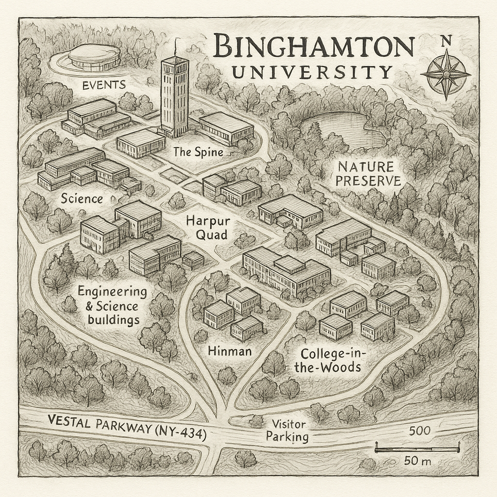

# Day 9 of 30 Day Map Challenge - Analog

**Day 9 (Analog)**: For this challenge, I created a hand-drawn map of the Binghamton University campus, where I finished my undergraduate degree. This analog map was created using traditional pen-and-paper methods. The hand-drawn approach allows for a more artistic and personal interpretation of the campus layout.

## Hand-Drawn Map

This hand-drawn map accurately represents the spatial layout of Binghamton University's campus, but please forgive my poor hand-drawing skills.

## Comparison with AI-Generated Map

For comparison, I also experimented with asking ChatGPT to generate a hand-drawn style map of Binghamton University. While the AI produced an interesting artistic interpretation, the spatial layout is completely inaccurate:

### Key Observations:

- **Spatial Accuracy**: The hand-drawn map maintains the correct spatial relationships between buildings and campus features, while the ChatGPT-generated version shows a completely incorrect layout that does not match the actual campus geography.
  
- **Geographic Fidelity**: The traditional hand-drawn approach preserves the essential geographic information and navigational utility of the campus map, despite its being poorly drawn. The AI map is more aesthetically pleasing but lacks accuracy and effective spatial representation.

- **AI Limitations**: This comparison highlights an important limitation of current AI image generation models - while they can produce aesthetically pleasing results in a particular style, they often fail to maintain spatial accuracy and geographic correctness, which are fundamental requirements for functional maps.

This exercise demonstrates that some cartographic tasks, especially those requiring spatial accuracy, still benefit from traditional analog methods or careful digital mapping over purely AI-generated outputs.
