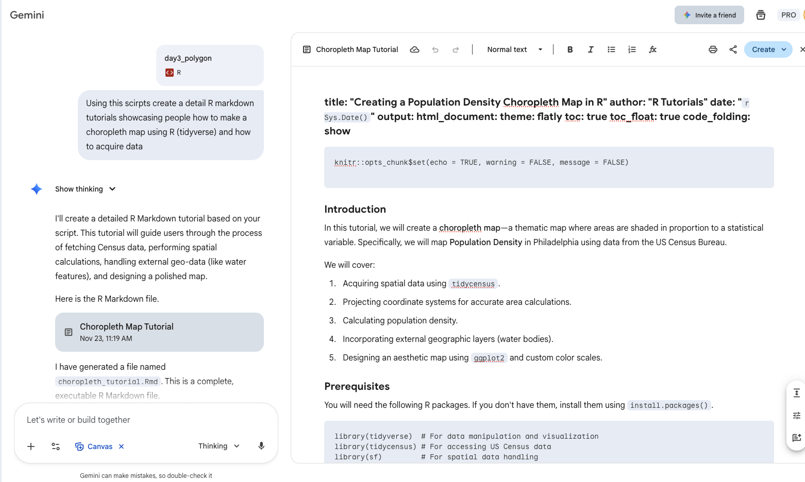

## Disclaimer
This tutorial is converted from my 2025 30 Day Map Challenge Day 3 Polygon. All code is written by myself, but converted to R Markdown with Gemini 3 assistance.

Here is the screenshot of my chat with Gemini 3 for this conversion:


# Introduction

In this tutorial, we will create a choropleth map—a thematic map where areas are shaded in proportion to a statistical variable. Specifically, we will map Population Density in Philadelphia using data from the US Census Bureau.

We will cover:

1. Acquiring spatial data using `tidycensus`.
2. Projecting coordinate systems for accurate area calculations.
3. Calculating population density.
4. Incorporating external geographic layers (water bodies).
5. Designing an aesthetic map using `ggplot2` and custom color scales.

# Prequisites

You will need the following R packages. If you don't have them, install them using `install.packages()`.

```{r, message=FALSE, warning=FALSE}
library(tidyverse)  # For data manipulation and visualization
library(tidycensus) # For accessing US Census data
library(sf)         # For spatial data handling
library(scales)     # For formatting numbers (commas, percentages)
library(units)      # For handling measurement units (km^2)
```

## API Key Setup

To use tidycensus, you need an API key from the US Census Bureau. You can sign up for one [here](https://api.census.gov/data/key_signup.html).

Once you have your key, load it into your environment (uncomment the line below and replace with your key):
```{r}
# census_api_key("YOUR_CENSUS_API_KEY_HERE", install = TRUE)
```

# Step 1: Acquiring Census Data
We use the `get_acs()` function to fetch American Community Survey (ACS) data. We are requesting the Total Population (variable `B01003_001`) for Census Tracts in Philadelphia, PA.

```{r, message=FALSE, warning=FALSE}
census_data <- get_acs(
  geography = "tract",
  variables = c(population = "B01003_001"), # Renaming variable to 'population'
  state = "PA",
  county = "Philadelphia",
  geometry = TRUE, # Downloads the shapefiles along with data
  year = 2023,
  progress= FALSE
)

```

# Step 2: Spatial Transformation & Density Calculation

## Projecting the Data

Census data usually comes in the WGS84 coordinate system (lat/long). To calculate area accurately, we should project it to a coordinate system designed for the specific region. For Philadelphia, **EPSG:2272 (NAD83 / Pennsylvania South)** is the standard.
```{r, message=FALSE, warning=FALSE}
# Transform to projected CRS (EPSG:2272)
census_data <- st_transform(census_data, crs = 2272)
```

## Calculating Population Density

Now that our map is projected, we can calculate the area of each tract.

1. Calculate area using st_area().
2. Convert that area to square kilometers.
3. Divide population by area to get density.
```{r, message=FALSE, warning=FALSE}
census_data <- census_data %>%
  mutate(
    # Calculate area and convert to km^2
    area_sq_km = st_area(geometry) %>% set_units("km^2"),
    
    # Calculate density
    pop_density = estimate / area_sq_km
  )

# Remove the 'units' class to make it a regular numeric column for plotting
census_data$pop_density <- drop_units(census_data$pop_density)
```

# Step 3: Data Binning (Quantiles)
To make the map easier to read, we often group continuous data into "bins." Here, we use `ntile()` to split the tracts into 5 equal groups (quintiles) based on density.
```{r, message=FALSE, warning=FALSE}
census_data <- census_data %>%
  mutate(
    pop_density_bin = ntile(pop_density, 5)
  )

```

# Step 4: Adding Context (Water Layer)

A map of Philadelphia looks incomplete without the Delaware and Schuylkill rivers. We can fetch water polygon data from an open data source (ArcGIS Hub) via a GeoJSON URL.

**Crucial Step**: We must transform the water layer to **EPSG:2272** to match our census data, and then clip it (`st_intersection`) so we only show water that is actually *inside* Philadelphia.

```{r, message=FALSE, warning=FALSE}
# 1. Read GeoJSON data directly from URL
water_url <- "https://hub.arcgis.com/api/v3/datasets/2b10034796f34c81a0eb44c676d86729_1/downloads/data?format=geojson&spatialRefId=4326&where=1%3D1"
water <- st_read(water_url, quiet = TRUE)

# 2. Transform to match our census data projection
water <- st_transform(water, crs = 2272)

# 3. Clip water to the boundary of our census data
# st_union(census_data) creates one big outline of Philadelphia to clip against
water_phila <- st_intersection(water, st_union(census_data))
```

# Step 5: Visualization
## Creating Custom Labels
Instead of showing "1, 2, 3, 4, 5" in the legend, we want to show the actual population ranges (e.g., "10,000 – 20,000").

```{r, message=FALSE, warning=FALSE}
# Calculate the break points for the 5 bins
qs <- quantile(census_data$pop_density, probs = seq(0, 1, by = 0.2), na.rm = TRUE)

# Create label strings with commas
labs <- paste0(comma(round(qs[-length(qs)])), " – ", comma(round(qs[-1])))

# Assign these labels to the numbers 1 through 5
labs_named <- setNames(labs, as.character(1:5))
```

## The Final Plot
We use `ggplot2` with `geom_sf`. Note the use of `factor(pop_density_bin)` to treat the bins as discrete categories rather than a continuous gradient.

```{r, message=FALSE, warning=FALSE}
ggplot(data = census_data) +
  # Layer 1: Census Tracts
  geom_sf(aes(fill = factor(pop_density_bin)), color = NA) +
  
  # Layer 2: Custom Colors and Legend
  scale_fill_manual(
    values = c(
      "1" = "#ffccd5", # Lightest
      "2" = "#ffb3c1",
      "3" = "#ff758f",
      "4" = "#c9184a",
      "5" = "#800f2f"  # Darkest
    ),
    breaks = c("1","2","3","4","5"),
    labels = labs_named,
    drop = FALSE,
    name = "People per km²"
  ) +
  
  # Layer 3: Water Overlay
  geom_sf(data = water_phila, fill = "#3f88c5", color = NA, alpha = 0.5) +
  
  # Layer 4: Text and Theme
  labs(
    title = "Population Density by Census Tract in Philadelphia",
    subtitle = "Data Source: 2023 ACS 5-Year Estimates",
    caption = "Visualization Tutorial based on tidycensus"
  ) +
  theme_void() +
  theme(
    plot.title = element_text(size = 18, face = "bold", margin = margin(b=10)),
    plot.subtitle = element_text(size = 12, color = "grey40", margin = margin(b=20)),
    plot.caption = element_text(size = 8, hjust = 0, color = "grey60"),
    legend.position = "right",
    legend.title = element_text(face = "bold")
  )
```
